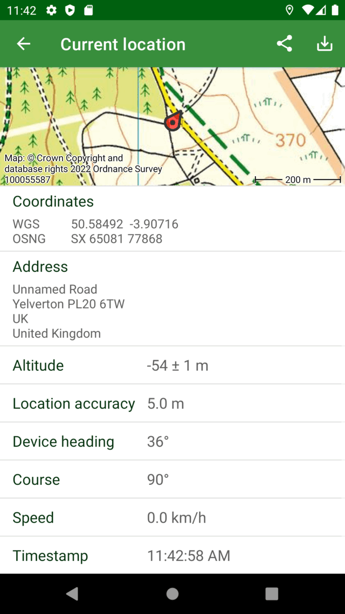
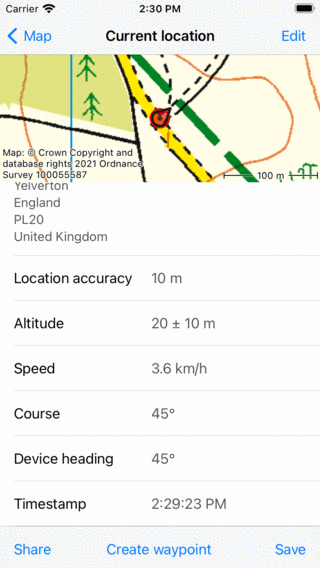

.. _sec-posmarker:

Your location
=============
Your location is displayed on the :ref:`map <sec-maps>` with the position marker:

   *The position marker*

If you are standing still, the position marker points in the direction in which you point your device.
If you are moving, the position marker points in the direction in which you are moving.

The arrow in the status bar next to the battery icon, indicates that the location services are currently in use. This can cause faster battery consumption than usual. Therefore pay attention to the battery level when using Topo GPS.

The default position marker icon is red, you can :ref:`change it to another color <ss-settings-posmarker>` via :ref:`Menu <sec-menu>` > More > Settings > Styles > Position. This might to increase the visibility of the position marker ont the map.

To center the map on your location, tap the center button on the left hand side of the :ref:`dashboard <sec-dashboard>`.

Recommended Android Settings
----------------------------
To enable location access for Topo GPS, first make sure that Android Settings > Apps > Topo GPS > Permissions > Location is enabled. Then in the
same screen give Topo GPS access to precise location while using the app.

.. _ss-current-location-screen:

Current location screen
-----------------------
If you tap the position marker on the map, the current location screen will appear. 
You can also open this screen by pressing long on the :ref:`position button <ss-position-button>` on the :ref:`dashboard <sec-dashboard>`.

The current location screen shows details of your current location. In the current location screen you can also save your current location
into a waypoint and export your current location with the buttons in the top toolbar. An example of the current location screen is displayed below:

   *The current location screen (top part).*
   

   *The current location screen (bottom part).*
   
In the location information screen you find subsequently the following information:

- *Map*: A map of the surroundings of your current location. You can also zoom and move this map.
- *Coordinates*: The coordinates of your current location in various formats. You change the visible formats by going to Menu > More > Settings > :ref:`Displayed coordinate types <sec-settings-coordinates>`.
- *Address*: The approximate address of your location. If you move this address will be updated automatically. If you press long on the address you can select and share it. If you go to Menu > More > Settings you can disable automatic lookup of addresses in the current location screen.
- *Altitude*: The current altitude of the device above the WGS84 geoid with the accuracy.
- *Location accuracy*: The accuracy of the location determination. This accuracy means that your true location has a high probability of being inside a circle with a radius equal to the accuracy. If the GPS signal is good the location accuracy is 5 m or less.
- *Course*: The direction which respect to the true north in which the device is moving.
- *Device heading*: The direction with respect to the true north in which the device is pointing.
- *Speed*: The current speed of the device.
- *Timestamp*: The exact time at which the displayed location was obtained.

.. _ss-current-location-save:

Saving current location
~~~~~~~~~~~~~~~~~~~~~~~
By tapping the ‘Save’ icon in the top right of the current location screen you can save your current position as a :ref:`waypoint <sec-wp>`. The waypoint will be given a title based on the current date and time.

If you tap the 'Save' icon your current position will be saved immediately as a waypoint and added to the main. You will also return to the main map.

.. _ss-current-location-create:

Sharing current location
~~~~~~~~~~~~~~~~~~~~~~~~
By pressing the 'Share' icon in the top right of the current location screen you can share your location. An export pop-up will appear exactly as what happens when :ref:`exporting waypoints <ss-waypoints-exporting>`.
